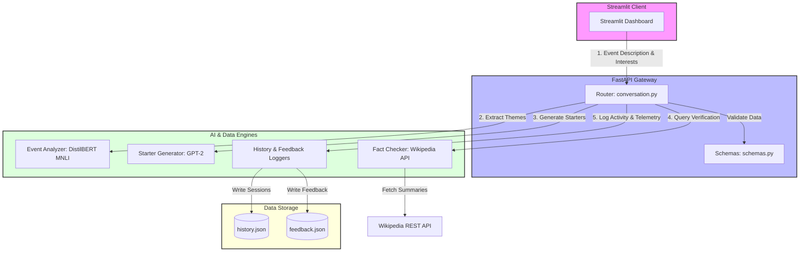

<div align="center">

# 🤝 Personalized Networking Assistant

<p align="center">
  <strong>An AI-Powered Event Intelligence and Conversation Starter Generator</strong>
</p>

[](https://www.python.org/)
[](https://fastapi.tiangolo.com/)
[](https://streamlit.io/)
[](https://huggingface.co/models)
[](https://docs.pytest.org/)
[](https://locust.io/)

---

<p align="center">
  <a href="#-system-architecture">Architecture</a> •
  <a href="#-key-features">Key Features</a> •
  <a href="#-file-structure">File Structure</a> •
  <a href="#-installation--setup">Setup</a> •
  <a href="#-running-the-application">Run Guide</a> •
  <a href="#-rest-api-documentation">API Reference</a> •
  <a href="#-testing--benchmarking">Testing</a> •
  <a href="#-team-members">Contributors</a>
</p>

</div>

## 📖 Overview

The **Personalized Networking Assistant** is a high-tech, AI-driven application designed for event attendees, conference speakers, and professionals. It provides instant, context-aware conversation starters and topic intelligence. 

By analyzing raw event descriptions, it extracts core thematic keywords, generates engaging talking points matched to user interests, fact-checks references using Wikipedia, and logs telemetry analytics to refine performance.

---

## 🧠 System Architecture



---

## 🎯 Key Features

*   **🔍 High-Fidelity Theme Extraction**: Leverages Hugging Face's `transformers` pipelines using the `typeform/distilbert-base-uncased-mnli` model to perform zero-shot classification on raw event descriptions.
*   **💬 Tailored Conversation Starters**: Generates icebreakers utilizing a local `gpt2` generation pipeline, dynamically matching extracted event themes with the user's explicit interests.
*   **📚 Auto Fact-Checking**: Validates extracted topic relevance and definitions on-the-fly by querying the official **Wikipedia REST API**, providing users with instant context.
*   **📜 Session Telemetry**: Automatically records user activities and event sessions for persistent history logging.
*   **📊 Feedback Loop**: Allows users to rate generated conversation starters with 👍/👎, tracking preferences in a telemetry log file to support future model optimizations.
*   **⚡ Built for Scale**: Integrates unit testing with `pytest` and performance benchmarking with `locust`.

---

## 📁 File Structure

The project has a modular, scalable directory layout separating core backend logic, schemas, routing, and frontend components:

```
networking-assistant/
├── app/                              # Backend Application Source
│   ├── config.py                     # App settings and model path configurations
│   ├── main.py                       # FastAPI initialization and startup entrypoint
│   ├── models/                       # Data schemas and request/response models
│   │   └── schemas.py                # Pydantic schemas for data validation
│   ├── routers/                      # Route controllers
│   │   └── conversation.py           # Main endpoints router (Analyze, Generate, Fact-check, logs)
│   └── services/                     # Core Business Logic & AI Engines
│       ├── event_analyzer.py         # Zero-shot theme extraction service
│       ├── fact_checker.py           # Wikipedia REST API query service with local caching
│       ├── feedback_logger.py        # Feedback collection and persistence service
│       ├── history_logger.py         # Session history logging service
│       ├── storage.py                # Generic file-based storage provider
│       └── topic_generator.py        # GPT-2-based text generation service
├── frontend/                         # Frontend Application Source
│   └── app.py                        # Streamlit client dashboard script
├── tests/                            # Test Suite
│   ├── conftest.py                   # Pytest fixtures and mock setup
│   ├── test_event_analyzer.py        # Unit tests for event theme extraction
│   ├── test_fact_checker.py          # Unit tests for Wikipedia verification
│   ├── test_loggers.py               # Unit tests for feedback and history loggers
│   ├── test_routes.py                # Integration tests for FastAPI endpoints
│   └── test_topic_generator.py       # Unit tests for GPT-2 prompt generation
├── feedback.json                     # Local JSON storage for feedback logs
├── history.json                      # Local JSON storage for session history
├── locustfile.py                     # Locust performance test suite
├── requirements.txt                  # Python dependencies
└── README.md                         # Project documentation
```

---

## 🛠️ Installation & Setup

Follow these steps to set up and run the project locally.

### Prerequisites

*   Python 3.12 or higher installed.
*   Minimum 8GB RAM (recommended for hosting transformer pipelines locally).

### 1. Clone & Navigate to Project

```bash
git clone <repository-url>
cd networking-assistant
```

### 2. Set Up Virtual Environment

Initialize a virtual environment to isolate the project dependencies:

**On Windows:**
```powershell
python -m venv venv
venv\Scripts\activate
```

**On macOS/Linux:**
```bash
python3 -m venv venv
source venv/bin/activate
```

### 3. Install Dependencies

Install all core dependencies including `torch`, `transformers`, `fastapi`, and `streamlit`:

```bash
pip install -r requirements.txt
```

> [!NOTE]
> The initial application run will download the `typeform/distilbert-base-uncased-mnli` and `gpt2` models from the Hugging Face Hub. This download can take a few minutes depending on network bandwidth.

---

## 🚀 Running the Application

To run the application fully, you must start the **FastAPI Backend Service** and the **Streamlit Frontend Client** simultaneously.

### Step 1: Start the Backend (FastAPI)

Run the backend server using `uvicorn`. This starts the API on port `8000` by default.

```bash
uvicorn app.main:app --host 127.0.0.1 --port 8000 --reload
```

*   **API Documentation**: Once running, access the interactive API docs at [http://127.0.0.1:8000/docs](http://127.0.0.1:8000/docs).
*   **Alternative Port**: If port `8000` is in use, start the backend on another port:
    ```bash
    uvicorn app.main:app --port 8080 --reload
    ```

### Step 2: Start the Frontend (Streamlit)

Open a new terminal window or tab, activate the virtual environment, and execute:

```bash
streamlit run frontend/app.py
```

Streamlit will launch a local server and print the access URL (usually [http://localhost:8501](http://localhost:8501)).

---

## 🔌 REST API Documentation

The FastAPI backend exposes the following endpoints:

| Endpoint | Method | Payload Scheme | Description |
| :--- | :--- | :--- | :--- |
| `/` | `GET` | *None* | Health-check endpoint confirming backend status. |
| `/analyze-event` | `POST` | `EventDescription` | Extracts top thematic categories from a raw event description. |
| `/generate-conversation` | `POST` | `ConversationRequest` | Generates conversation starter icebreakers mapped to user interests. |
| `/fact-check` | `POST` | `FactCheckRequest` | Verifies a specific term/query using Wikipedia summaries. |
| `/history` | `GET` | *None* | Retrieves persistent logs of all recent generated events. |
| `/feedback` | `POST` | `FeedbackRequest` | Persists a 👍 (like) or 👎 (dislike) rating for a specific starter. |
| `/feedback-log` | `GET` | *None* | Retrieves logs of all submitted user feedbacks. |

### Payload Schema Examples

#### `/generate-conversation` Request Body:
```json
{
  "description": "Tech summit covering Generative AI and Large Language Models.",
  "interests": ["artificial intelligence", "deep learning"]
}
```

---

## 🧪 Testing & Benchmarking

### Running Unit & Integration Tests

The project uses `pytest` to run its test suites, validating routing, generation, fact-checking, and file logging logic.

Run the entire test suite:
```bash
pytest
```

Run tests with details & coverage:
```bash
pytest -v
```

To run a specific test file (e.g., event analyzer tests):
```bash
pytest tests/test_event_analyzer.py
```

### Performance Load Testing (Locust)

This project contains a `locustfile.py` to benchmark performance under high concurrency. 

1. Install locust (if not already installed in your environment):
   ```bash
   pip install locust
   ```
2. Start the FastAPI backend server first.
3. Start the Locust runner:
   ```bash
   locust -f locustfile.py
   ```
4. Open the Locust web interface at [http://localhost:8089](http://localhost:8089) and configure:
   * **Number of users**: e.g., `10`
   * **Spawn rate**: e.g., `1`
   * **Host**: `http://127.0.0.1:8000`

---

## 💡 Key Architectural Details

<details>
<summary><b>1. GPT-2 Generation & Prompt Engineering</b></summary>
The system leverages a local `gpt2` model for icebreaker generation. Prompts are constructed matching user interests and event topics. A seed value is locked to provide reproducible responses.
</details>

<details>
<summary><b>2. Wikipedia Fact-Checking & Local Cache</b></summary>
Wikipedia lookups include a caching mechanism. Once a topic has been verified, subsequent requests are served from the local cache rather than fetching from the live REST API, minimizing network traffic.
</details>

<details>
<summary><b>3. Persistent Storage</b></summary>
Session logs and feedback logs are written in real-time to local `history.json` and `feedback.json` files, providing a lightweight database-free persistence structure.
</details>

---

## 👥 Team Members

- **Majeti NagaSai Rishi**
- **Kotha Meghana**
- **Riya**
- **Buddavarapu Taraka Venkata Manikanta**

</div>